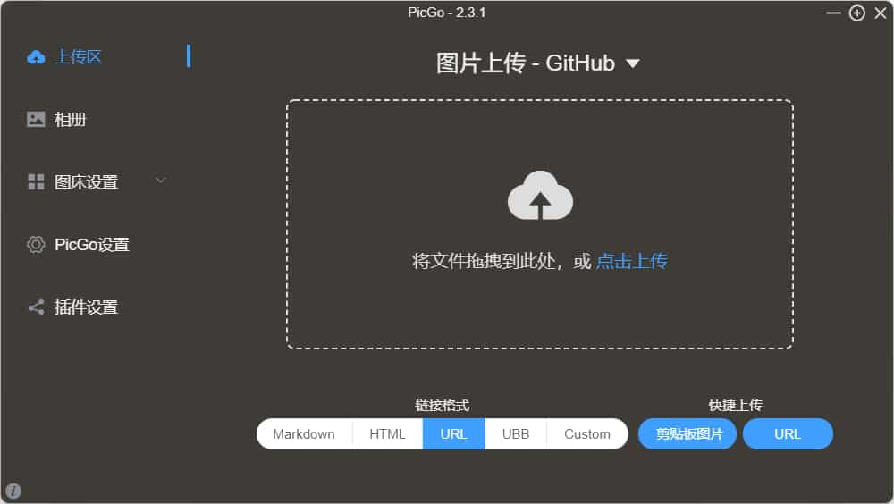
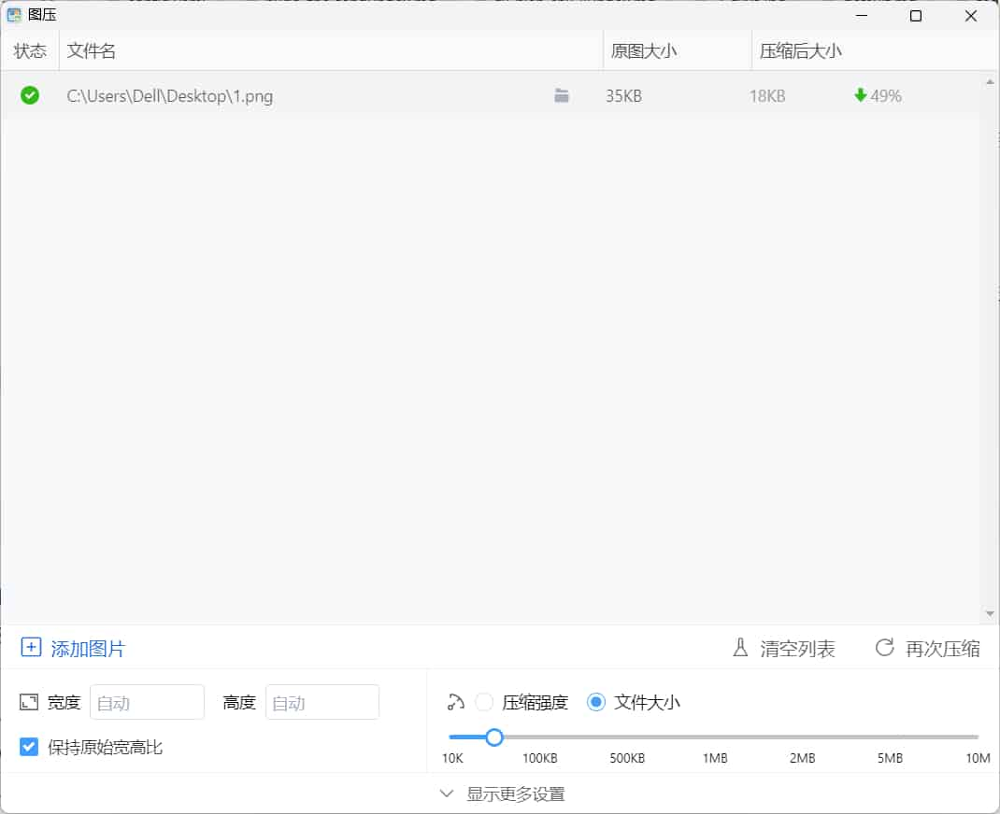

起初，我根据网上的方法尝试在GitHub搭建图床，但效果不好，访问速度太慢，检查后发现，用的一直都是原图，没有压缩
## 在GitHub搭建图床
我使用了pic go上传图片到仓库

上传速度可以，但是网站上加载就非常慢，于是使用jsdelivr做cdn加速，然而实测发现也就那回事，速度并不快，毕竟是原图
## 用压缩工具压缩
图片压缩采用开源压缩工具图压

压缩效率还是很高的，限制输出在50kb，这样网页呈现就会快一些。
后面会逐步换掉本网站已经存在的图片。